# Java Project – Bookstore & User Management

A REST API web application built with Spring Boot for comprehensive management of users, books, authors, categories, and payment system using the Strategy pattern. The project implements modern security (JWT, roles), user registration and login, exception handling, testing, OpenAPI documentation, and Docker deployment readiness.

---

## Table of Contents

1. [Project Description](#project-description)
2. [Technologies](#technologies)
3. [Project Structure](#project-structure)
4. [Features](#features)
5. [Database Structure](#database-structure)
6. [Installation & Running](#installation--running)
7. [Configuration](#configuration)
8. [Database Migration](#database-migration)
9. [API – Endpoints](#api--endpoints)
10. [Security](#security)
11. [Payment Handling](#payment-handling)
12. [Exception Handling](#exception-handling)
13. [Testing](#testing)

---

## Project Description

The system enables:

- User management (roles, registration, login with JWT)
- CRUD operations for books, authors, categories
- Payment handling (credit card, PayPal) using the Strategy design pattern
- Book searching and filtering by author and category
- Role assignment (ADMIN, USER)
- Global data validation and exception handling
- Complete REST API documentation (Swagger/OpenAPI)
- Unit and integration testing
- Ready-to-use Docker deployment

---

## Technologies

- Java 17+
- Spring Boot 3.0.0+
- Spring Data JPA (Hibernate)
- Spring Security (JWT)
- PostgreSQL (or H2 for tests)
- Docker, Docker Compose
- Flyway (database migrations)
- Lombok
- MapStruct (if used for DTO mapping)
- JUnit 5, Mockito (testing)
- Swagger/OpenAPI (REST API documentation)

---

## Project Structure


```
JAVA-ProjectLAB-main/
├── docker-compose.yml
├── mvnw
├── mvnw.cmd
├── pom.xml
├── src/
│   ├── main/
│   │   ├── java/
│   │   │   └── bookstore/
│   │   │       └── projektjavalab/
│   │   │           ├── ProjektJavaLabApplication.java
│   │   │           ├── config/
│   │   │           │   └── OpenApiConfig.java
│   │   │           ├── controller/
│   │   │           │   ├── AdminController.java
│   │   │           │   ├── AuthController.java
│   │   │           │   ├── AuthorController.java
│   │   │           │   ├── BookController.java
│   │   │           │   ├── CategoryController.java
│   │   │           │   ├── PaymentController.java
│   │   │           │   └── UserController.java
│   │   │           ├── dto/
│   │   │           │   ├── AuthResponse.java
│   │   │           │   ├── LoginRequest.java
│   │   │           │   ├── PaymentRequest.java
│   │   │           │   ├── RegisterRequest.java
│   │   │           │   └── UserResponseDto.java
│   │   │           ├── exception/
│   │   │           │   ├── GlobalExceptionHandler.java
│   │   │           │   └── RestExceptionHandler.java
│   │   │           ├── model/
│   │   │           │   ├── Author.java
│   │   │           │   ├── Book.java
│   │   │           │   ├── Category.java
│   │   │           │   ├── Role.java
│   │   │           │   └── User.java
│   │   │           ├── payment/
│   │   │           │   ├── CreditCardPayment.java
│   │   │           │   ├── PaymentContext.java
│   │   │           │   ├── PaymentStrategy.java
│   │   │           │   └── PaypalPayment.java
│   │   │           ├── repository/
│   │   │           │   ├── AuthorRepository.java
│   │   │           │   ├── BookRepository.java
│   │   │           │   ├── CategoryRepository.java
│   │   │           │   ├── RoleRepository.java
│   │   │           │   └── UserRepository.java
│   │   │           ├── security/
│   │   │           │   ├── CustomUserDetails.java
│   │   │           │   ├── CustomUserDetailsService.java
│   │   │           │   ├── JwtAuthenticationFilter.java
│   │   │           │   ├── JwtTokenProvider.java
│   │   │           │   └── SecurityConfig.java
│   │   │           ├── service/
│   │   │           │   ├── AuthorService.java
│   │   │           │   ├── AuthService.java
│   │   │           │   ├── BookService.java
│   │   │           │   ├── CategoryService.java
│   │   │           │   ├── UserRoleService.java
│   │   │           │   ├── UserService.java
│   │   │           │   └── impl/
│   │   └── resources/
│   │       ├── application.yml
│   │       └── db/
│   │           └── migration/
│   │               └── (SQL migrations)
│   └── test/
│       └── java/
│           └── bookstore/
│               └── projektjavalab/
│                   └── (tests)
├── .gitignore
└── README.md
```

---

## Features

- **User registration and login with JWT**
- **User management** (add, delete, edit, assign roles)
- **Book management** (add, edit, delete, assign to category and author, search)
- **Author management** (CRUD)
- **Category management** (CRUD)
- **Payments for books** – choose payment method (credit card, PayPal) – Strategy pattern
- **Roles (ADMIN/USER)** – some operations for ADMIN only
- **Validation and exception handling** – global exception handler
- **REST API documentation** – Swagger UI
- **Testing** – unit and integration tests for business logic and controllers
- **CORS support** – allows frontend integration

---

## Database Structure

- **User**:  `id`, `username`, `email`, `password`, `role`
- **Book**:  `id`, `title`, `isbn`, `price`, `author_id`, `category_id`, `description`
- **Author**:  `id`, `name`, `biography`
- **Category**:  `id`, `name`
- **Role**:  `id`, `name` (e.g. ADMIN, USER)
  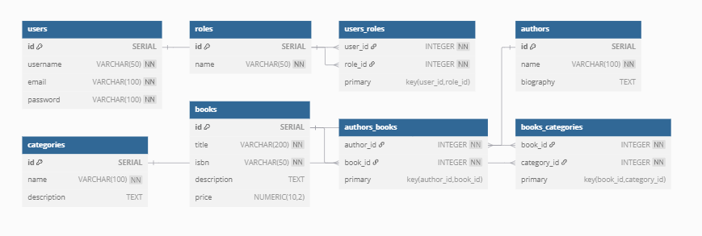

Relations:

- A book has one author and one category
- A user has an assigned role
- Extendable (e.g. orders, payments)

---

## Configuration

- **application.yml** Contains configuration for database, port, JWT settings, etc.

- **docker-compose.yml** Defines services (backend, PostgreSQL database), environment variables, and volumes.

---

## Database Migration

Flyway SQL migrations should be placed in `src/main/resources/db/migration/`.

Example:

- `V1__init_schema.sql`

Migrations are run automatically at application startup.

---

## API – Endpoints

Below are some example endpoints (see Swagger UI for all):

### Authentication & Registration

- `POST /api/auth/register` – Register user
- `POST /api/auth/login` – Login, returns JWT

**Sample UI – Login:**\
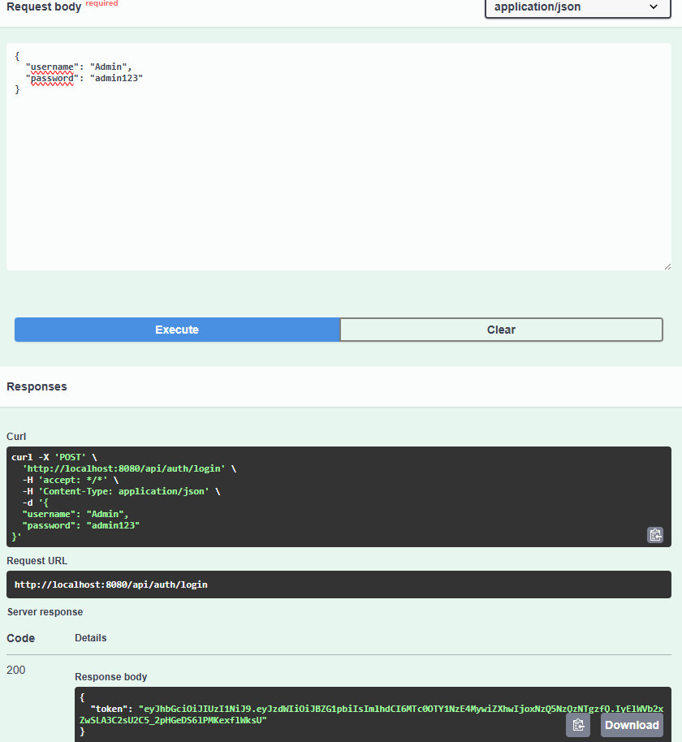


**Sample UI – Registration JSON:**\
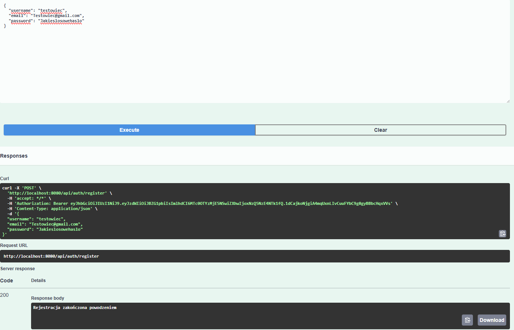

---

### Users

- `GET /api/users` – List users (ADMIN)
- `GET /api/users/{id}` – User details
- `POST /api/users` – Add user
- `PUT /api/users/{id}` – Edit user
- `DELETE /api/users/{id}` – Delete user (ADMIN)

**Sample UI – User by ID:**\

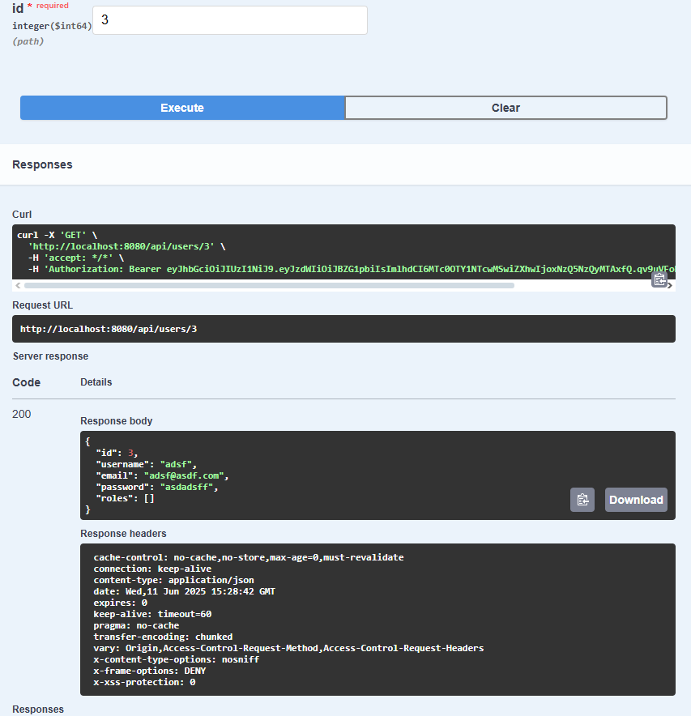

**Sample UI – Add user:**\

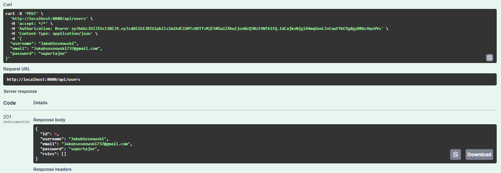

---

### Books

- `GET /api/books` – List books
- `GET /api/books/{id}` – Book details
- `POST /api/books` – Add book
- `PUT /api/books/{id}` – Edit book
- `DELETE /api/books/{id}` – Delete book

**Sample UI – Book by ID:**\
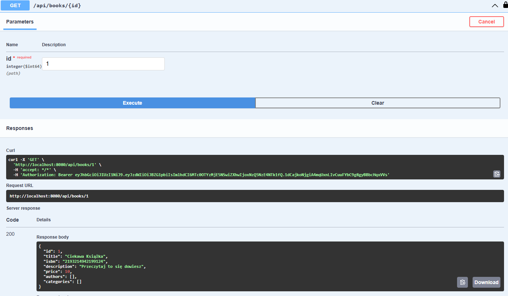


**Sample UI – Add book:**\
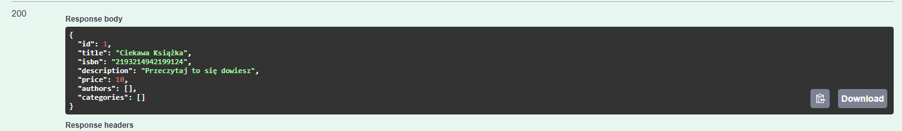


---

### Authors

- `GET /api/authors` – List authors
- `GET /api/authors/{id}` – Author details
- `POST /api/authors` – Add author
- `PUT /api/authors/{id}` – Edit author
- `DELETE /api/authors/{id}` – Delete author

**Sample UI – Authors list:**\
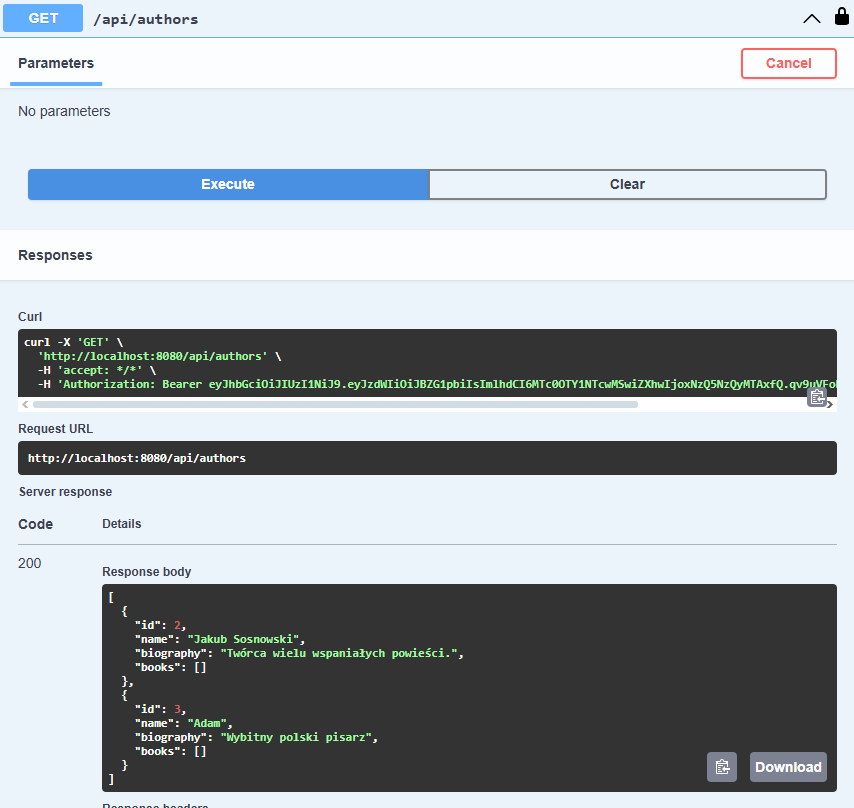


**Sample UI – Add author:**\
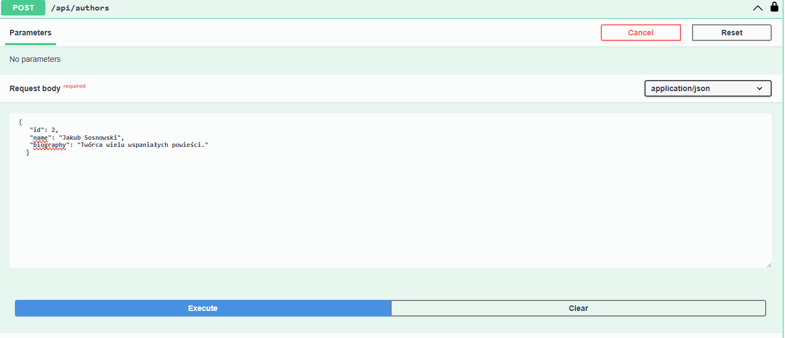


---

### Categories

- `GET /api/categories` – List categories
- `GET /api/categories/{id}` – Category details
- `POST /api/categories` – Add category
- `PUT /api/categories/{id}` – Edit category
- `DELETE /api/categories/{id}` – Delete category

**Sample UI – Categories list:**\
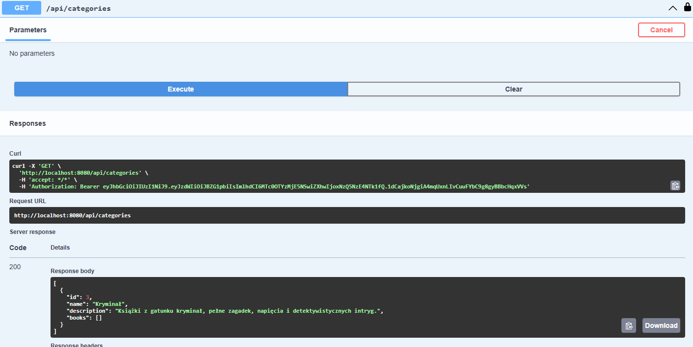


**Sample UI – Add category:**\
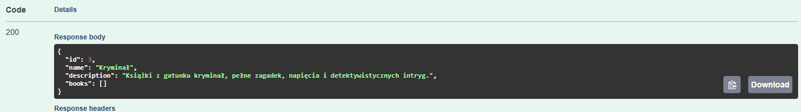


---

### Payments

- `POST /api/payment/pay` – Execute payment (provide method, e.g. "credit\_card" or "paypal")
  **Sample UI – paying:**\
  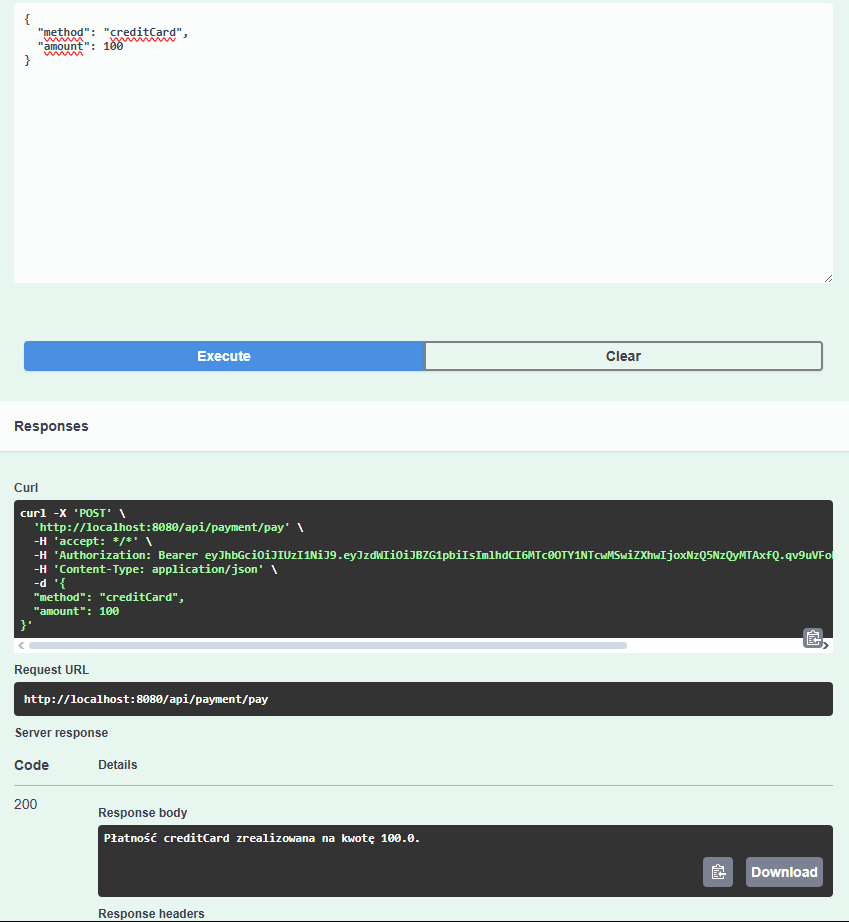
---

## Security

- JWT-based authentication and authorization
- User role configuration (ADMIN, USER)
- Endpoint protection with Spring Security

---

## Payment Handling

Payments are processed using the Strategy pattern (`PaymentStrategy`). Supported methods: **Credit Card** and **PayPal**.

Example request to `/api/payment/pay`:

```json
{
  "method": "paypal",
  "amount": 49.99
}
```

Example response:

```
"Paid 49.99 using PayPal."
```

---

## Exception Handling

- Global exception handling using `GlobalExceptionHandler` and `RestExceptionHandler`
- Returns HTTP errors with proper messages (400, 401, 404, 500, etc.)
- Example error responses are shown in Swagger UI

---

## API Documentation – Swagger

After launching the app, the documentation and live endpoint testing are available at:

```
http://localhost:8080/swagger-ui/index.html
```

---

## Testing

Unit and integration test files are located in `src/test/java/bookstore/projektjavalab/`.

- Unit tests cover business logic and controllers.
- Integration tests verify API and database cooperation (e.g. with H2 database).


**Test coverage:**

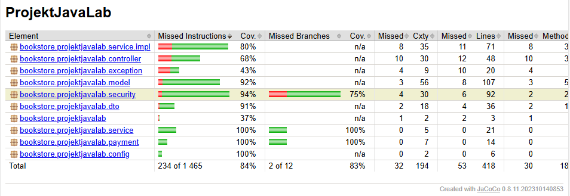


---

## Author

Jakub Sosnowski

